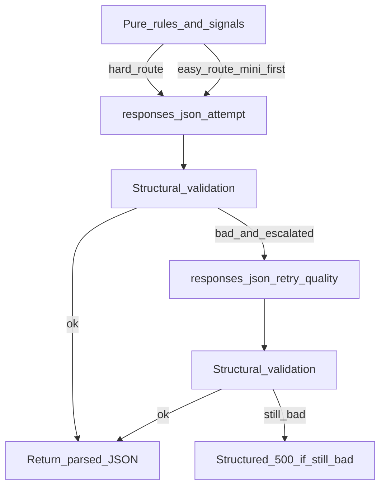

# Potential cost saving plan (adaptive JSON model routing)

**Status:** Planned  -  not implemented. This document preserves the design for automatic server-side routing between cheaper JSON models (e.g. `gpt-4o-mini`) and full-quality models (e.g. `gpt-4o`), with validation and a single escalation retry. Advisors get no in-app toggles.

**Related:** Per-pass OpenAI env vars and eval fixtures already exist from the earlier cost-tier work (`lib/openai-route-models.ts`, `README.md`). This plan adds **tier routing + validators** on top.

---

## Reality check (“bulletproof”)

- **100% correctness** from an LLM is not mathematically obtainable. This plan aims for **production-grade resilience**: deterministic rules, bounded retries (at most **one** extra JSON call after mini), graceful failure (clear server error vs silent garbage), observable **reason codes** (no client PII in logs when using codes only), and **Vitest-covered** routing logic.

---

## Goals (automatic, meeting-safe)

1. Advisors see **no new toggles**; routing is entirely server-side.
2. Prefer **`gpt-4o-mini`** on **JSON synthesis only** when the book is statistically “easy,” using existing env preference (`OPENAI_ANALYSIS_JSON_MODEL`, `OPENAI_ENRICHMENT_JSON_MODEL`).
3. Automatically **jump straight to full `gpt-4o`** when signals say classification/narrative risk is elevated.
4. If mini is attempted, **automatically retry once** with the **quality** JSON model after **cheap structural/compliance validators** fail (bounded cost).

Research (`web_search_preview`) and multimodal extraction **remain unchanged** by default; they continue to use existing envs (`OPENAI_ANALYSIS_RESEARCH_MODEL`, `OPENAI_ENRICHMENT_RESEARCH_MODEL`, `OPENAI_EXTRACTION_MODEL`). Optional future hook: escalate research separately (out of scope for v1 - adds latency/cost complexity).

---

## Configuration model (minimal surprise)

Keep today’s knobs, add explicit **quality** tiers so escalation is predictable:

| Variable | Meaning |
|---------|---------|
| `OPENAI_ANALYSIS_JSON_MODEL` | **Preferred/economy** JSON model for analysis (e.g. `gpt-4o-mini`) |
| `OPENAI_ANALYSIS_JSON_QUALITY_MODEL` | **Escalation / hard-route** model for analysis JSON (default `gpt-4o`) |
| `OPENAI_ENRICHMENT_JSON_MODEL` | **Preferred/economy** JSON model for enrichment |
| `OPENAI_ENRICHMENT_JSON_QUALITY_MODEL` | **Escalation / hard-route** model for enrichment JSON (default `gpt-4o`) |
| `ADVISORPILOT_JSON_TIER_ROUTING` | `0` disables routing+retry (restore “single model from env only” behavior). `1` enables routing. |

**Implementation note:** Default `ADVISORPILOT_JSON_TIER_ROUTING=1` only when economy ≠ quality; otherwise routing is a no-op. That preserves deployments that set only one model.

**Thresholds (env):** e.g. `ADVISORPILOT_ANALYSIS_HARD_TOTAL_VALUE`, `ADVISORPILOT_ANALYSIS_HARD_HOLDING_COUNT`, `ADVISORPILOT_ANALYSIS_HARD_TOP_WEIGHT_PCT`, `ADVISORPILOT_ANALYSIS_HARD_ANY_REVIEW_STATUS`, `ADVISORPILOT_ANALYSIS_HARD_NONQUALIFIED_WITH_BASIS`. Example defaults (tune before ship): total value ≥ $2M **or** holdings ≥ 40 **or** top line ≥ 25% of total **or** any `status === "review"` **or** taxable cost-basis nuances from registration summary  -  reuse `buildRegistrationSummaryForAnalysis` in `lib/holding-registration.ts`.

---

## Step-by-step implementation

### 1. Pure routing module (testable, no network)

Add `lib/openai-json-tier-routing.ts`:

- **`inferAnalysisJsonRoute(ctx)`**  -  inputs: `holdings[]`, `totalValue`, `registrationSummary` (or holdings + helper), normalized numbers (NaN → 0), empty holdings edge.
- **`inferEnrichmentJsonRoute(signal)`**  -  per holding: `proprietaryHint`, `holding.status`, `holding.confidence`, `figiHasSkip`, **generic sleeve risk** (e.g. `assetClass` in `["ETF","Mutual Fund","Unknown"]` or suggested contains “Needs” / “MANUAL”; align with `detectProprietaryHint` in `holding-enrichment.ts` and `extractLikelySymbol` in `holding-validation.ts`).
- Output: `{ mode: "quality_first" | "economy_first"; reasons: string[] }` for logs.

### 2. Validators after each JSON Responses call

Add `lib/openai-analysis-json-validator.ts` and `lib/openai-enrichment-json-validator.ts` (or one combined file):

- **Analysis:** parse success; shape checks aligned with `app/api/generate-analysis/route.ts`; synopsis touches `analysisDate`; array lengths mirror prompts (see patterns in `lib/openai-model-eval.integration.test.ts`).
- **Enrichment:** `mappedAssetClass` satisfies `isCanonicalAssetClass` from `asset-classes.ts`; numeric `confidence`; boolean `needsAdvisorReview`; URL expectations when ticker present aligned with existing post-check logic in `holding-enrichment.ts`.

### 3. Shared “call JSON with optional escalation” helper

Add `lib/openai-responses-json.ts`:

- **`callResponsesJsonWithTier`**  -  args: `openai`, `input`, `economyModel`, `qualityModel`, `mode`, `validate`, `logTag`.
- Flow: first model from mode; if validator fails **and** economy ≠ quality **and** first attempt was economy → **one** quality retry; if still bad → throw for route → 500 JSON `{ error, reasonCodes }` without echoing prompts.

### 4. Wire `app/api/generate-analysis/route.ts`

After `researchNotes`, compute route. Replace single `analysisJsonModel()` Responses call path with helper. Log escalation passes (e.g. `json_escalated`).

### 5. Wire `lib/holding-enrichment.ts`

After `researchNotes`, compute per-holding route before JSON call. Do **not** change cash-like early return or cache hit path.

### 6. Extend `lib/openai-route-models.ts`

Add: `analysisJsonQualityModel()`, `enrichmentJsonQualityModel()`, `jsonTierRoutingEnabled()`, default quality `gpt-4o`.

### 7. Tests

- Router unit tests: table-driven scenarios (empty holdings, huge/small totals, concentration, review flags, proprietary, generic ETF class, FIGI skip, confidence bands, NaN total).
- Validator unit tests: pass/fail JSON fixtures.
- Optional: mock `openai.responses.create` for retry path without network.

### 8. Documentation

Update `README.md` OpenAI section with plain-English routing, envs, and kill switch.

---

## Scenario matrix

| Scenario | Enrichment JSON | Analysis JSON |
|---------|------------------|---------------|
| Routing disabled (`ADVISORPILOT_JSON_TIER_ROUTING=0`) | Single: `OPENAI_ENRICHMENT_JSON_MODEL` | Single: `OPENAI_ANALYSIS_JSON_MODEL` |
| Economy == Quality (same model id) | One call; no retry | Same |
| Cash-like / cache hit | No JSON AI | N/A |
| Proprietary / low confidence / `status=review` / FIGI skip / generic wrapper | **Quality first** | N/A |
| Portfolio: high total / many lines / concentration / review line / taxable+basis nuance | N/A | **Quality first** |
| Economy first, validator passes | One economy call | One economy call |
| Economy first, validator fails | Economy + one quality retry | Economy + one quality retry |
| Fails after quality | 500 + reason codes | Same |
| OpenAI API error | No blind duplicate retry; surface error | Same |
| Bad request body | Existing validation | Same |

---

## Non-goals (v1)

- No UI toggle; no per-client preference store.
- No automatic research-model switching.
- No unbounded retries (max **two** JSON completions: economy then quality).

---

## Implementation backlog

1. **routing-module**  -  Add `openai-json-tier-routing.ts`; extend `openai-route-models`; kill switch.
2. **validators-helper**  -  Validators + `callResponsesJsonWithTier`.
3. **wire-routes**  -  Integrate `generate-analysis` + `holding-enrichment`; escalation logging.
4. **tests-docs**  -  Vitest + README updates.
